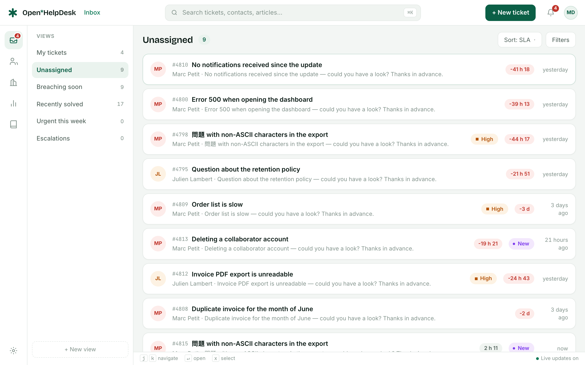
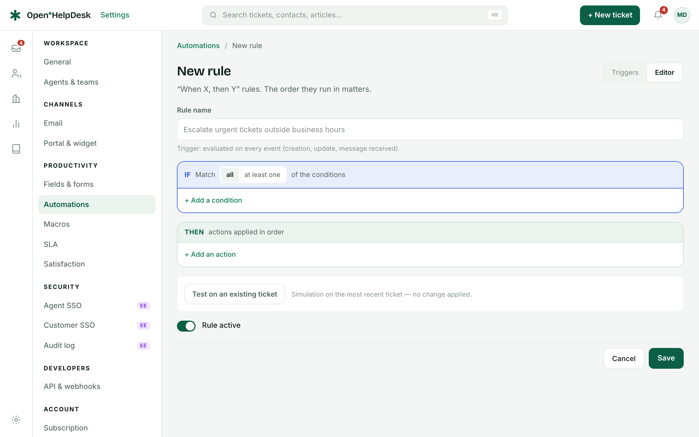
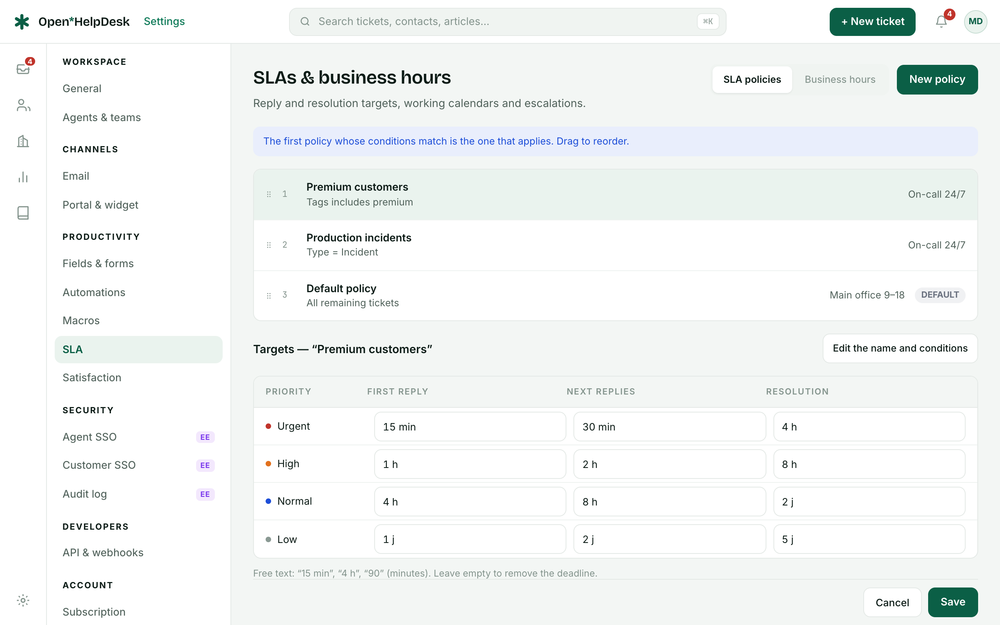
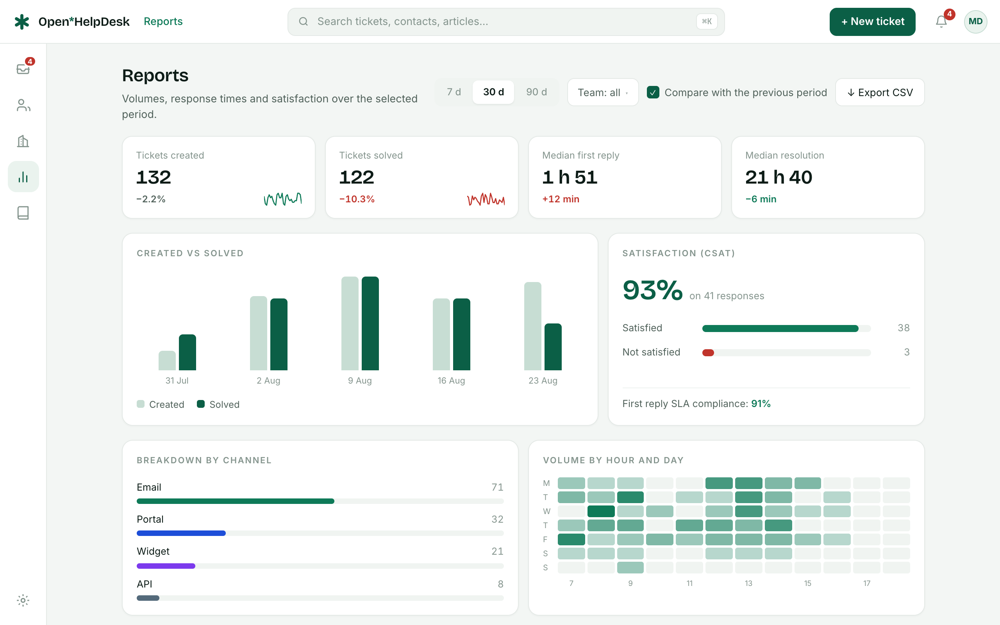
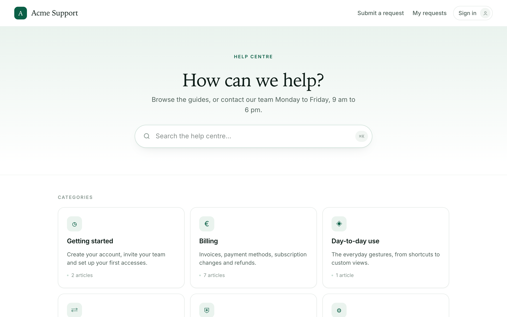

# Open HelpDesk

**The free, open-source alternative to Zendesk and Freshdesk.** A complete
customer support desk — ticketing, email, automations, SLA, CSAT, knowledge base
and customer portal — that runs on your own servers, with **unlimited agents**
and no per-seat bill.

[](LICENSE)
[](https://github.com/open-helpdesk/open-helpdesk/actions/workflows/ci.yml)
[](CHANGELOG.md)


## Why Open HelpDesk

- **Unlimited agents.** Seats are not a licence lever here. Add the whole team,
  add the interns, add the people who answer three tickets a month.
- **Your data stays yours.** One `docker compose up`, your PostgreSQL, your
  storage, your email transport. Nothing leaves the machine you chose.
- **Not a toy.** The email channel is bidirectional, the SLA clock respects
  business hours, the automations run on real triggers, and the customer portal
  is a real portal with magic-link accounts and search deflection.
- **Open core, honest boundary.** Everything you need to run a support desk is
  AGPL-3.0. The commercial licence covers exactly three features — agent SSO,
  delegated customer-organization SSO, the advanced audit log — and they live in
  one directory you can read: [`ee/`](ee/).
- **25 languages** out of the box, with dictionary parity enforced at compile
  time — a missing translation fails the build, it does not ship as English.

> **Alpha.** The product works end to end and is covered by a Playwright smoke
> suite, but APIs, schema and screens still move. Not production-ready yet — a
> very good time to try it and open issues.

## What it looks like

### The inbox — keyboard-first, and it tells you what needs you

Saved views down the left, and every row says the same three things in the same
place: the priority when it is High or Urgent, the SLA countdown, the status.
`j`/`k` to move, `↵` to open, `x` to select.



### Automations — "when X, then Y", and a dry run before you commit

Conditions, actions in order, and a **Test on an existing ticket** panel that
simulates the rule against real data without changing anything.



### SLA — targets per priority, on working hours

Ordered policies, the first match wins. Targets per priority for the first
reply, the following replies and the resolution — counted against the calendar
you define, not against wall-clock time.



### Reports — the numbers a support lead actually asks for

Volumes, median first reply, median resolution, SLA compliance, CSAT, breakdown
by channel, and a volume heat map by hour and weekday. CSV export included.



### The customer portal — a real help centre, not a form

Public articles with search, an embeddable widget, magic-link accounts so a
customer can follow their own requests, and article voting.



## Features

- **Ticketing** — conversations, internal notes, priorities, views, macros,
  tags, keyboard-first inbox, ⌘K palette
- **Email channel** — outbound via SMTP, Resend, Brevo or Mailjet (credentials
  encrypted at rest); inbound via provider webhooks or IMAP polling
- **Automations** — trigger rules, scheduled rules, round-robin assignment,
  auto-close
- **SLA & CSAT** — policies with business hours, satisfaction surveys
- **Knowledge base & portal** — public help center, embeddable widget,
  magic-link customer accounts, article voting and search deflection
- **Reports** — operational dashboard, CSV export
- **Multi-tenant** — subdomain resolution, PostgreSQL row-level security
- **25 languages** — the 24 official EU languages + Norwegian, with strict
  dictionary parity enforced at compile time
- **Installation diagnostics** — a six-probe health card in Settings → General

## Self-host in three commands

```bash
git clone https://github.com/open-helpdesk/open-helpdesk && cd open-helpdesk
cp .env.example .env   # set BETTER_AUTH_SECRET and ENCRYPTION_KEY
docker compose up -d
```

Open http://localhost:3000 — the stack (web, worker, PostgreSQL 17, Redis,
MinIO) starts with a demo workspace: `marie.dupont@acme.example` /
`demo-openhelpdesk`. Set `SEED_DEMO=false` once your own agents exist. The
diagnostics card in **Settings → General** tells you what is left to configure.

## Development

```bash
corepack enable
pnpm install
cp .env.example .env
docker compose -f docker/docker-compose.yml up -d   # deps + Mailpit for emails
pnpm db:generate && pnpm db:migrate
pnpm --filter @openhelpdesk/db db:rls
pnpm db:seed && pnpm db:seed:auth
pnpm dev
```

Then open http://acme.localhost:3000. See [CONTRIBUTING.md](CONTRIBUTING.md).

## Licensing

Open HelpDesk is open-core, and the licence boundary is the `ee/` directory:

- **Core — [AGPL-3.0](LICENSE).** Everything outside [`ee/`](ee/): ticketing,
  email channel, automations, SLA, CSAT, knowledge base, customer portal,
  reports and API, with unlimited seats.
- **`ee/` — commercial licence.** Agent SSO (SAML/SCIM), delegated
  customer-organization SSO and the advanced audit log. The source is visible
  and free to use in development and testing, but production use requires a
  commercial agreement — see [`ee/LICENSE`](ee/LICENSE).

## Documentation

English documentation is planned. In the meantime, [CONTRIBUTING.md](CONTRIBUTING.md)
covers the development setup, and the diagnostics card (Settings → General)
covers the installation.

## Security

Please report vulnerabilities privately — see [SECURITY.md](SECURITY.md).
