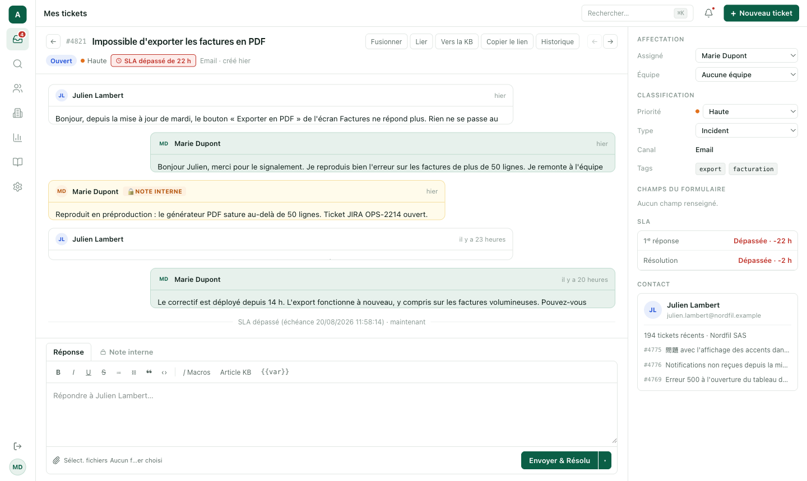

# Open HelpDesk

**Open-core helpdesk you can actually self-host.** Ticketing, email channel,
automations, SLA, CSAT, knowledge base and customer portal — AGPL-3.0 core,
commercial features in [`ee/`](ee/), and a managed cloud on the way.

[](LICENSE)
[](https://github.com/open-helpdesk/open-helpdesk/actions/workflows/ci.yml)
[](CHANGELOG.md)

> **Alpha.** The core product (roadmap lots 0–3) works end-to-end and is
> covered by a Playwright smoke suite, but APIs, schema and screens still move
> fast. Not production-advice yet — perfect time to try it and open issues.



## Features

- **Ticketing** — conversations, internal notes, priorities, views, macros,
  tags, keyboard-first inbox, ⌘K palette
- **Email channel** — outbound via SMTP, Resend, Brevo or Mailjet (credentials
  encrypted at rest); inbound via provider webhooks or IMAP polling
- **Automations** — trigger rules, scheduled rules, round-robin assignment,
  auto-close
- **SLA & CSAT** — policies with business hours, satisfaction surveys
- **Knowledge base & portal** — public help center, embeddable widget,
  magic-link customer accounts, article voting and search deflection
- **Reports** — operational dashboard, CSV export
- **Multi-tenant** — subdomain resolution, PostgreSQL row-level security
- **25 languages** — the 24 official EU languages + Norwegian, with strict
  dictionary parity enforced at compile time
- **Installation diagnostics** — a six-probe health card in Settings → General

## Self-host in three commands

```bash
git clone https://github.com/open-helpdesk/open-helpdesk && cd open-helpdesk
cp .env.example .env   # set BETTER_AUTH_SECRET and ENCRYPTION_KEY
docker compose up -d
```

Open http://localhost:3000 — the stack (web, worker, PostgreSQL 17, Redis,
MinIO) starts with a demo workspace: `marie.dupont@acme.example` /
`demo-openhelpdesk`. Set `SEED_DEMO=false` once your own agents exist. The
diagnostics card in **Settings → General** tells you what is left to configure.

## Development

```bash
corepack enable
pnpm install
cp .env.example .env
docker compose -f docker/docker-compose.yml up -d   # deps + Mailpit for emails
pnpm db:generate && pnpm db:migrate
pnpm --filter @openhelpdesk/db db:rls
pnpm db:seed && pnpm db:seed:auth
pnpm dev
```

Then open http://acme.localhost:3000. See [CONTRIBUTING.md](CONTRIBUTING.md).

## Editions & licensing

| | Self-hosted (AGPL-3.0) | Cloud / Enterprise |
|---|---|---|
| Ticketing, email, automations, SLA, CSAT, KB, portal, reports, API | ✔ unlimited seats | ✔ |
| Agent SSO (SAML/SCIM), customer-organization SSO, audit log | — | `ee/`, commercial license |
| AI triage & reply suggestions, custom domains, multi-brand | — | planned |
| Hosting, backups, support | your infra | managed |

Everything outside [`ee/`](ee/) is [AGPL-3.0](LICENSE). The `ee/` directory is
source-visible but requires a commercial agreement for production use — see
[`ee/LICENSE`](ee/LICENSE). The full breakdown lives in
`specs/01-produit-et-architecture.md` § 6.

## Documentation

Product specifications (51 screens), design system and implementation notes
live in [`specs/`](specs/README.md) and [`design-notes/`](design-notes/) —
**currently written in French**. English documentation is planned.

Une version française de ce README est disponible : [README.fr.md](README.fr.md).

## Roadmap

| | |
|---|---|
| ✅ Lots 0–3 | Core ticketing, email, automations/SLA/CSAT, portal & KB — this release |
| 🔜 Lot 4 | Managed cloud (signup, provisioning, billing) |
| 🔜 Lot 5 | Enterprise identity (SAML/SCIM runtime, delegated customer SSO), AI |
| 🔜 Lot 6 | Public website & docs |

## Security

Please report vulnerabilities privately — see [SECURITY.md](SECURITY.md).
